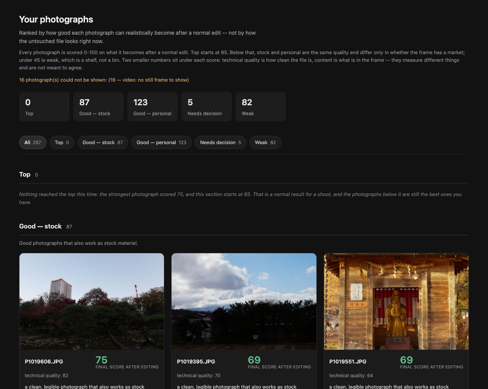

# photo-ai-toolkit

[](https://github.com/karasov-co/photo-ai-toolkit/actions/workflows/ci.yml)
[](LICENSE)
[](https://www.python.org/downloads/)

**You came back from a trip with 2,000 frames and you have opened the folder
four times without editing anything.** This sorts them into five piles, ranks
every pile by what each photograph can *become* after a normal edit, says in one
sentence why, and writes a Lightroom starting point for the ones worth an
evening.



It never moves, changes or deletes an original file.

---

## Start without paying anything

```bash
pip install -r requirements.txt
python3 cli.py analyze --input ./photos --output ./run
open ./run/report/index.html
```

No API key needed. That run gives you every technical measurement, the duplicate
groups, the edit recipes and the full report. What it cannot do is look at the
picture — no content check, no artistic read, and nothing can be ranked as a top
photograph, because nothing looked at it.

For that, add a key and run the same command:

```bash
cp .env.example .env       # then put XAI_API_KEY=... in it, once
python3 cli.py analyze --input ./photos --output ./run
```

It prints the estimated cost and waits for you to type `yes`. About **$1.90 per
100 photographs** on grok-4.6 — measured from a real run's token usage,
reasoning tokens included. Every call is logged to `run/.internal/usage.jsonl`
and the real total is printed at the end, so the estimate is checkable rather
than trusted. `--reasoning low|medium|high` is the dial; low is the default.

Do not `source .env` or `export` anything — the application loads the file
itself, from the project root, whichever directory you run from. `.env` is
gitignored and never committed.

---

## What you get

`run/report/index.html` is a folder you can copy, zip or email. It has no
external requests — no CDN, no web fonts, no JavaScript libraries — so it opens
on a plane, behind a firewall, and in five years. `--standalone` produces a
single `report_standalone.html` with every thumbnail inlined, for sending to one
person.

The decision also arrives where you actually cull. `edit_recipes/ratings/` holds
one XMP per photograph with a star rating and a colour label — five stars for
top, two for weak — that Bridge and Photo Mechanic read straight from the
folder. For Lightroom Classic, `photoai apply-ratings` merges them into the
sidecars beside your originals: it changes the rating and the label and nothing
else, keeps a `.before-photoai` copy, and shows the diff before writing. Then
Metadata > Read Metadata from File. Colours are yours to set with
`PHOTO_AI_LABELS` — red already means something in most catalogues.

And the loop closes. After a week of working in Lightroom, your own stars are in
those same sidecars, so `bench-quality --from-catalog` measures the tool against
your real choices without you labelling anything.

Five piles, with the count of each at the top of the page:

| Pile | What it means |
|---|---|
| **Top** | Scores 85+. The photographs that carry the shoot. Often empty, which is normal. |
| **Good — stock** | Good, and the frame also has a market. |
| **Good — personal** | Exactly as good. No market, which is not a fault. |
| **Needs decision** | Something is genuinely unclear. You decide, not the tool. |
| **Weak** | A shelf, not a bin. Nothing is deleted. |

Each card carries three numbers, and they measure different things:

- **final score after editing** — the big one, what the photograph becomes
- **technical quality** — how clean the file is right now
- **content** — the moment, the composition, the subject (present only when the
  content check ran)

A pristine picture of nothing scores high on the second and low on the third.
That pair disagreeing is the point of showing both.

---

## Everything it does

Grouped by what you would be trying to do. Depth on any of it is in
[docs/](#read-next).

**Look at the files, without a key or a network**
EXIF and RAW metadata; exposure, clipping, focus and motion measurement,
measured on the *sensor* data for RAW rather than the rendered JPEG; corrupt and
empty-frame detection; resolution gates; perceptual-hash duplicate clustering
with a BK-tree; per-cluster best-frame choice with the margin that decided it;
video sampling through FFmpeg.

**Look at the pictures, with a key**
Stage 2 ranks frames against each other in groups of twelve — genre, content,
unrepeatability, documentary value, recoverability — and stitches the group
ranks into one order with Bradley–Terry, so a frame keeps the population it was
ranked against. Stage 3 is the artistic read: intent, resonance, whether an odd
frame is a mistake or a decision, with face crops when the frame calls for them.

**Decide, and say why**
One 0–100 score per photograph, five piles, and a written reason for the pile in
the reader's language (en/ru). Calibration profiles change the weighting without
touching code. Confidence is reported, and a low-confidence frame goes to
*needs decision* rather than being guessed at.

**Suggest the edit**
A per-frame recipe — exposure, white balance, highlight recovery, shadow lift,
denoise, sharpening — with the measurement that earned each step. Optional
darkroom pass renders candidates and validates them (skin-tone protection, halo
and clipping checks) so a recipe that makes things worse is rejected rather than
shipped. Export as XMP sidecars for Lightroom, darktable or RawTherapee, written
beside the RAW and never over an existing one.

**Sell it, if that is what you are doing**
Stock metadata: title, description, ordered keywords, categories, concepts,
location (only from something actually recorded — coordinates are not a place
name), AI-provenance label. Marketplace fit per platform from a rules file, with
technical blockers named. Submission CSV and XMP sidecars. Nothing is ever
uploaded anywhere.

**Learn your taste**
`ask` puts the most informative questions first; `record` stores each answer; a
personal preference model then abstains on unfamiliar cameras and genres rather
than pretending. `bench-quality` correlates the score against a ranking you
supply. `monitor` tracks false-trash rate and drift and can switch automation
off.

**Never lose anything**
Deletion is a proposal: a list, a contact sheet of the frames on that list, and
a script that moves them to the Trash. Quarantine is fenced to the source root,
reversible with `restore`, and `purge` sits behind four gates. Runs are cached
by content checksum and analyzer version, saved every three groups, and a failed
run keeps everything it already paid for.

---

## Every command

19 subcommands. `photoai <command> --help` prints the same thing in full.

| Command | What it does |
|---|---|
| `analyze` | **The command.** Preflight, measure, content check, artistic read, report |
| `measure` | Local measurement only, explicitly not an analysis |
| `report` | Filter, sort and re-render a stored run — no re-analysis, no tokens |
| `reclassify` | Redo routing at different thresholds — no re-analysis, no tokens |
| `bench-quality` | Correlate the score against a human ranking you supply |
| `darkroom` | Render the edit suggestions from a stored run |
| `apply-recipe` | Write a recipe beside the RAW (dry run; refuses to clobber) |
| `apply-ratings` | Merge the stars and labels into your own sidecars (dry run) |
| `export` | Build a marketplace package: CSV, sidecars, instructions |
| `quarantine` | Carry out a move plan (dry run unless `--apply`) |
| `trash` | Carry out `delete_plan.json` (dry run unless `--apply`) |
| `restore` | Undo a quarantine operation |
| `purge` | Permanently delete, behind four gates |
| `override` | Record a manual decision future runs must respect |
| `ask` | The questions worth five minutes, most informative first |
| `record` | Record one decision for the personal model |
| `policy` | What would be automated, and what is holding each gate shut |
| `monitor` | False-trash rate, drift, calibration; can switch automation off |
| `profiles` | Inspect and dump calibration profiles |
| `validate-profile` | Check a profile JSON before a run depends on it |

**Global:** `--lang en|ru`, `-v/--verbose`.

**`analyze` and `measure`** share:
`--input*` `--output*` `--quarantine` `--profile` `--profile-file` `--expert`
`--no-video` `--video-samples` `--force` `--limit` `--standalone`
`--embed-width` `--embed-quality` `--jobs` `--copyright` `--darkroom`
`--renderer` `--no-shadow-mode`.
`analyze` adds: `--model` `--provider` `--base-url` `--no-stage3`
`--reasoning low|medium|high` `--concurrency` `-y/--yes` `--insights-scope
new|all`.

**`report`:** `--analysis*` `--format` `--sort` `--media` `--route-class`
`--route` `--genre` `--marketplace` `--min-score` `--min-potential`
`--min-confidence` `--cluster` `--duplicates-only` `--limit`.

**`reclassify`:** `--analysis*` `--profile` `--profile-file` `--limit`.
**`bench-quality`:** `--analysis*` `--from-catalog` `--template` `--labels`
`--json`. `--from-catalog` reads the stars you already gave these photographs
out of the sidecars beside them, so the check costs you no time at all.
`--template`
writes a blank labelling sheet; fill its `human_pile` column and pass it back as
`--labels` to see how far the thresholds are from your own sorting. See
[what it does not do](docs/limits.md).
**`darkroom`:** `--analysis*` `--output` `--limit`.
**`apply-recipe`:** `--recipe*` `--raw*` `--apply` `--force`.
**`apply-ratings`:** `--analysis*` `--apply`.
**`export`:** `--analysis*` `--output` `--platform`.
**`quarantine`:** `--analysis*` `--quarantine*` `--input` `--apply`.
**`trash`:** `--plan` `--trash` `--apply`.
**`restore`:** `--quarantine` `--operation` `--apply` `--monitor`.
**`purge`:** `--quarantine` `--older-than` `--confirm` `--apply`.
**`override`:** `--analysis*` `--set-class` `--set-genre` `--set-marketplace`
`--exclude` `--note` `--clear` `--list`.
**`ask`:** `--analysis*` `--limit`.
**`record`:** `--store*` `--signal*` `--winner` `--loser` `--asset` `--answer`
`--genre` `--camera` `--note`.
**`policy`:** `--analysis*`.  **`monitor`:** `--state` `--enable` `--holdout`.
**`profiles`:** `--name` `--dump`.

`*` = required.

**Environment:** `XAI_API_KEY` (then `OPENAI_API_KEY` as fallback),
`PHOTO_AI_PROVIDER`, `PHOTO_AI_BASE_URL`, `OPENAI_MODEL`.

---

## Nothing moves unless you say so

The output is a farm of symlinks pointing back at wherever your files already
live, plus a CSV of the same decisions as data. Deletion is a two-step ritual:
the tool writes a list, a contact sheet of the frames on that list, and a script
that moves them to the Trash. It never removes anything itself, and `--apply` is
the only thing that carries out a plan.

---

## Read next

- **[What it does not do](docs/limits.md)** — measured limits and unverified
  paths, stated plainly, because you are pointing this at your own archive
- **[How the score is built](docs/how-it-works.md)** — potential versus current
  quality, the five piles, the artistic read, what a card is telling you
- **[Commands, output and configuration](docs/reference.md)** — the output tree,
  calibration profiles, marketplaces, metadata, every flag in prose
- **[Internals, safety and limits](docs/internals.md)** — architecture, the
  model and why there is no fallback, quarantine, development, known limits

---

## Install

Python 3.12+. FFmpeg is optional and only needed for video.

```bash
pip install -r requirements.txt
brew install ffmpeg          # macOS; apt-get install ffmpeg on Debian/Ubuntu
```

Or install the `photoai` command into your environment:

```bash
pip install -e .
photoai analyze --input ./photos --output ./run
```

The key is looked for in this order: a variable already set in your shell, then
`.env` in the project root. `XAI_API_KEY` first, `OPENAI_API_KEY` as a fallback,
because most people already have one of those sitting in a file somewhere.

## Disclaimer

A score is one opinion about a photograph, produced by measurements and a
language model, and both are wrong sometimes. Nothing here is a verdict. The
tool is built so that every suggestion is reversible and every original file is
untouched — look at the pictures before you act on any of it.

## Contributing

Issues and pull requests welcome. `ruff check . && pytest -q` must pass.

## License

MIT. See [LICENSE](LICENSE).
